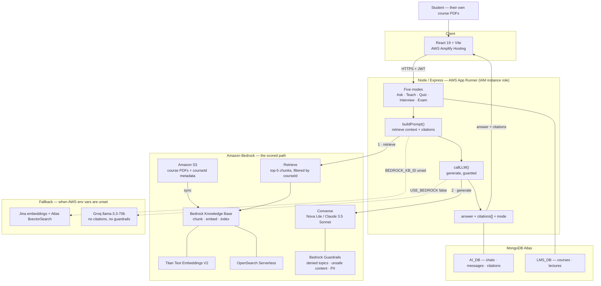

# VidyaAI — Your Syllabus, Your Tutor, on AWS

> **First Commit · Bharat Builds Tour · Sept 17–20, 2026**
> Team **Null_Pointers** · Ship It Track

---

## The Problem

Millions of Indian students study from course PDFs with no one to ask at 11 PM. Generic chatbots hallucinate and can't cite the syllabus. We fix exactly that.

## What We Built

**VidyaAI** turns any course into a personal AI tutor — powered by a single Amazon Bedrock pipeline that answers questions **with citations to the source PDF**, generates quizzes, runs mock interviews, sets practice exams, and blocks unsafe queries with Guardrails. One brain, many hats — all grounded in the student's own material.

### 🎬 Demo Video

> 📹 *[Link to 3-min demo video — to be added on submission]*

### 🌐 Live URL (Ship It)

> 🚀 *[Deployed URL — to be added after deployment]*

---

## How It Works — One Spine, Many Hats

One AWS-native pipeline powers every surface the student sees:

| Surface | What it does |
|---|---|
| **Understand** | Q&A with citations — ask a course question, get a grounded answer with source references |
| **Test Yourself** | Auto-generated MCQs from the course material |
| **Interview Prep** | Mock interviewer that adapts difficulty, grounded in the syllabus |
| **Exam Prep** | Full practice papers with auto-grading and partial marks |
| **Safety** | Bedrock Guardrails block off-topic and unsafe queries — responsible AI for students |

All of these route through the **same** `buildPrompt → callLLM` path. No separate pipelines, no duplicated logic.

---

## Architecture



A high-resolution version for slides and the demo video: [`architecture.svg`](./architecture.svg)

### AWS Services Used

| Service | Role |
|---|---|
| **Amazon S3** | Stores course PDFs (the knowledge source) |
| **Amazon Bedrock Knowledge Base** | Managed RAG — ingests PDFs, chunks, embeds, and retrieves with citations |
| **Amazon Titan Text Embeddings V2** | Embedding model powering the Knowledge Base |
| **Amazon OpenSearch Serverless** | Vector store backing the Knowledge Base (auto-provisioned) |
| **Amazon Bedrock (Nova / Claude)** | LLM for answer generation via the Converse API |
| **Amazon Bedrock Guardrails** | Blocks unsafe / off-topic queries — responsible AI for a student tutor |

---

## What We Built During First Commit

This project builds on an existing LMS codebase. Here's what's new versus what existed before:

| Component | Before (pre-existing) | Built during First Commit |
|---|---|---|
| **Retrieval** | Jina embeddings + MongoDB Atlas `$vectorSearch` | **Amazon Bedrock Knowledge Base** (Titan + OpenSearch Serverless) |
| **LLM** | Groq (Llama 3.3) | **Amazon Bedrock** (Nova / Claude via Converse API) |
| **Safety** | None | **Bedrock Guardrails** — blocks unsafe/off-topic, redacts PII |
| **Citations** | None (just joined chunk text) | **Real source citations** — PDF name + snippet, rendered in UI |
| **Frontend** | Basic chat bubble | Markdown rendering, citations block, guardrail visual treatment |
| **Deployment** | Vercel + Render | **AWS** (Ship It track — live URL) |

The env-flag routing (`USE_BEDROCK=true` / `BEDROCK_KB_ID`) means the old path still works as a fallback — clean engineering, not a hard cutover.

---

## Tech Stack

| Layer | Technology |
|---|---|
| **Frontend** | React 19, Vite, Tailwind CSS, React Markdown, Zustand |
| **Backend** | Node.js, Express 5 |
| **AI (AWS)** | Bedrock Knowledge Base, Titan Embeddings V2, Bedrock LLM (Nova/Claude), Bedrock Guardrails |
| **Storage** | Amazon S3 (PDFs), MongoDB Atlas (chat history) |
| **Deployment** | AWS (Ship It) |

---

## Local Setup

### 1. Clone

```bash
git clone https://github.com/Anish033-coder/vidyaai.git
cd vidyaai
```

### 2. Backend

```bash
cd backend
cp .env.example .env   # Fill in your AWS + MongoDB credentials
npm install
npm run dev            # Runs on port 5002
```

### 3. Frontend

```bash
cd ../frontend
cp .env.example .env   # Set VITE_BACKEND_URL
npm install
npm run dev            # Runs on port 3001
```

### 4. AWS Setup

Follow the [AWS-RUNBOOK.md](./AWS-RUNBOOK.md) — create your Bedrock Knowledge Base, upload course PDFs to S3, enable model access, and set the env vars.

---

## What We Learned

We migrated a working RAG pipeline off third-party APIs (Jina + Groq + MongoDB Atlas vector search) onto **Amazon Bedrock Knowledge Bases** in 4 days. Along the way we learned:

- How Bedrock Knowledge Bases manage the entire embed → store → retrieve pipeline
- How the `RetrieveCommand` returns structured citation metadata (source URI, snippet, score)
- How Guardrails integrate into the Converse API with zero extra infrastructure
- How to design env-flag routing so a codebase cleanly supports both legacy and AWS paths

---

## AI Coding Tools Used

Per the tour rules, here are the AI coding tools used on this project:

- **Claude Code (Anthropic)** — code review, refactoring, debugging, documentation, and the AWS preflight script

---

## Verifying the AWS Path

The tutor falls back to the legacy Jina/Groq/Atlas path when the AWS env vars are missing, and the fallback looks almost identical in the UI. To confirm you are actually running on Bedrock:

```bash
cd backend
npm run preflight -- --course <mongoCourseId> --q "a real question from your PDFs"
```

It reports which path each leg will take, then live-tests Knowledge Base retrieval (including the `courseId` metadata filter), Bedrock generation, and Guardrail intervention. Exits non-zero if anything is still on the legacy path.

---

## 👥 Team — Null_Pointers

<table>
  <tr>
    <td align="center">
      <a href="https://github.com/Anish033-coder">
        <br />
        <b>Anish Kumawat</b>
      </a><br />
      <sub>Leader</sub>
    </td>
    <td align="center">
      <a href="https://github.com/Prasoon52">
        <br />
        <b>Prasoon Patel</b>
      </a>
    </td>
    <td align="center">
      <a href="https://github.com/Sushant748">
        <br />
        <b>Sushant Verma</b>
      </a>
    </td>
    <td align="center">
      <a href="https://github.com/pranavpanmand">
        <br />
        <b>Pranav Panmand</b>
      </a>
    </td>
  </tr>
</table>

---

## License

MIT — see [LICENSE](./LICENSE).

---

## Scope

VidyaAI began as one module inside a larger LMS the team had built previously. This repository contains **only the tutor** — the retrieval and generation pipeline, and the interface around it. Everything in this repo is what the submission is about; nothing is claimed here that the demo video doesn't show.

The courses and lectures the tutor reads from live in that existing LMS database, which is why the backend opens a second read connection (`LMS_DB`) alongside its own.
